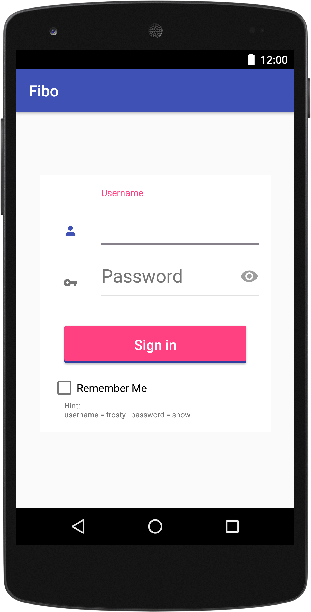
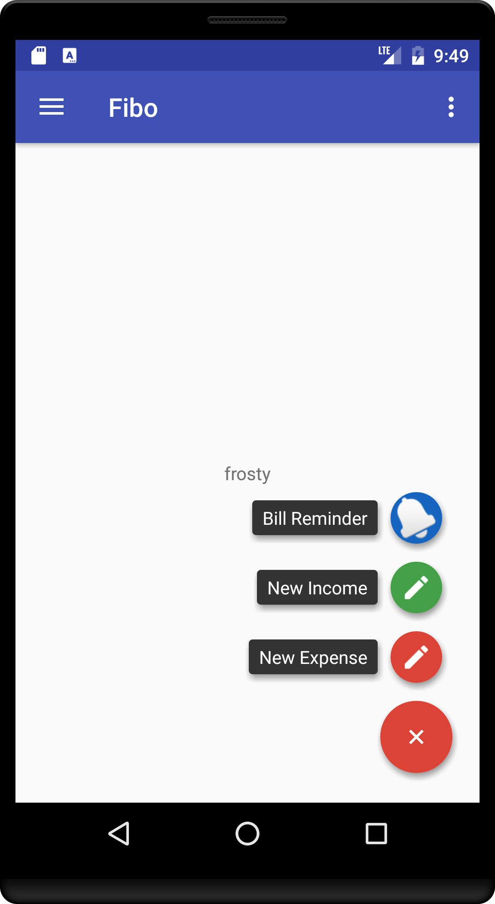
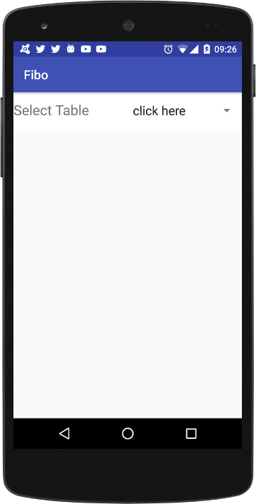
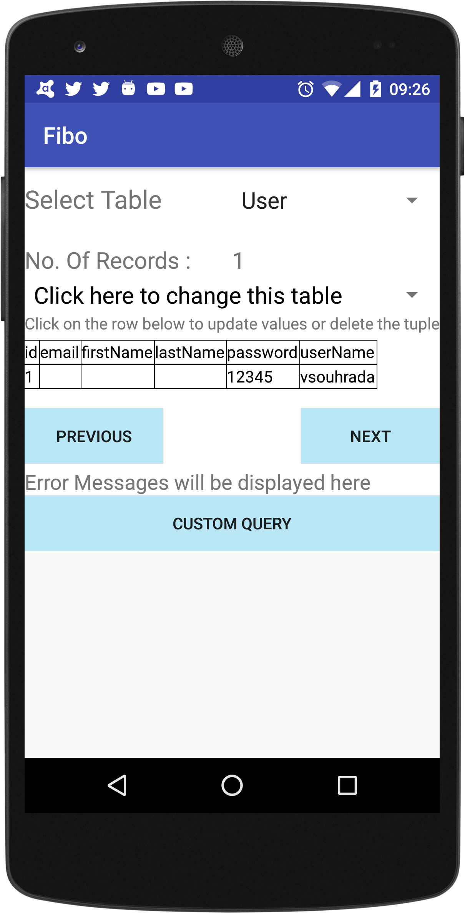
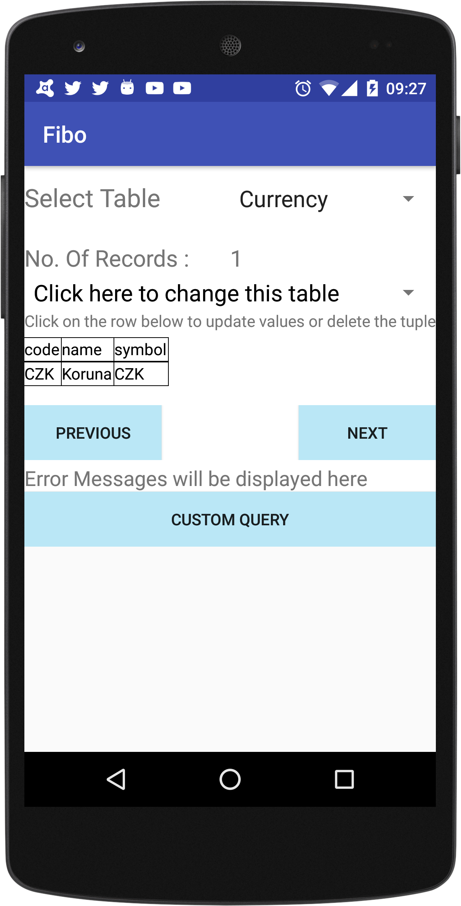

## Kotlin & Anko for Android Development

This is the code where you can learn how to use Kotlin & Anko for Android development.
 
Because I'm a big fan of the [Requery](https://github.com/requery/requery) library so I'm using it 
for persistent layer.
 
A whole project is now under development so it is not complete. 

Name of application is Fibo - Finance Board - at the end it should be finance managers which you can find 
a lot of in Google Play store, but I want on this usecase show that using a Kotlin, Anko is very powerful 
for android development.

Used libraries/frameworks
* Kotlin - 1.1-M04
* [Anko](https://github.com/Kotlin/anko) - 0.9
* [Requery](https://github.com/requery/requery) - 1.0.0-rc3
* Dagger 2.2
* RxAndroid 1.2.1
* RxKotlin 0.60.0

* Note
 * DrawerActivity is not written in Kotlin yet
 * Documentation is in progress
 * Demo app is under development

### App Description
In this application I would like to use and show libraries which I think are very interesting and 
useful for Android development.

#### Login View
In case of that you are running app for first time - then you need to create an account.
So enter there username and password.

<p align="center">
  
</p>

A whole view and activity in a code is written in Kotlin by using Anko.

As I said the login process is written in Kotlin and Anko is used to create UI not in XML but 
directly in code by using Anko DSL features.

So view you can find in class [CreateUserView](https://github.com/vsouhrada/kotlin-anko-demo/blob/master/app/src/main/kotlin/com/vsouhrada/kotlin/android/anko/fibo/function/user/CreateUserView.kt)

What is interesting in this class - that UI is not created in XML but in code:
```kotlin
override fun createView(ui: AnkoContext<CreateUserActivity>) = with(ui) {
        verticalLayout {
            padding = dip(30)
            val usernameEditText = editText {
                id = R.id.userNameEditText
                hintResource = R.string.create_user_hint_username
                textSize = 24f
            }

            val passwordEditText = editText {
                hintResource = R.string.create_user_hint_password
                textSize = 24f
            }

            button {
                textSize = 26f
                textResource = R.string.create_user_create_button_text
                onClick { view -> handleOnCreateAction(usernameEditText, passwordEditText) }
            }
        }
    }
```

The connection between activity and View created in Anko is defined in `onCreate()` method in activity by calling:
`CreateUserView(bus).setContentView(this)`
(See CreateUserActivity)
```kotlin
override fun onCreate(savedInstanceState: Bundle?) {
        super.onCreate(savedInstanceState)
        // DI
        activityComponent().inject(this)
        // Create view
        CreateUserView(bus).setContentView(this)

        toast("Create a NEW User")

    }
```

#### Dashboard View
Please keep in a mind that app is under development so do not expect some cool functionality yet.
<p align="center">
  
</p>

Currently we have there only one functionality - if you click on FAB button -> then you DB Manager activity 
starts.

#### DB Manager View
DB manager is there only to show that we have a data inside of sqlite database.
Here you can see (select table User or Currency) that Requery framework is working.
<p align="center">
  
  
  
</p>

Next features will be added soon