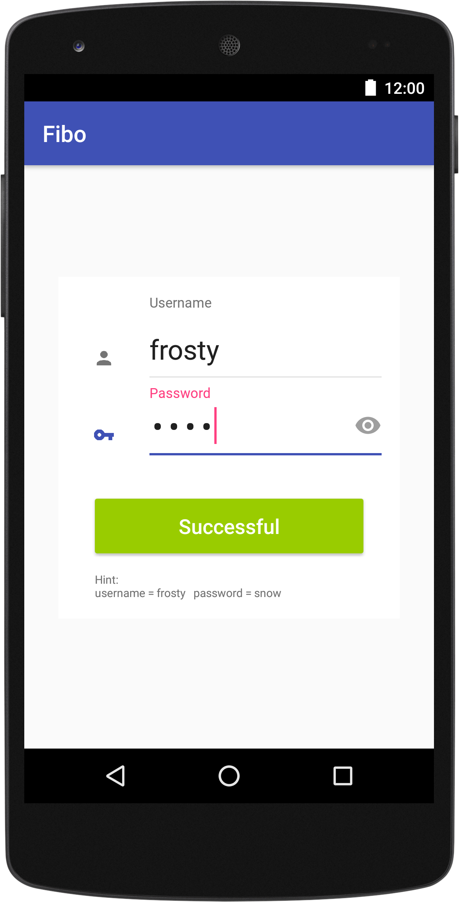
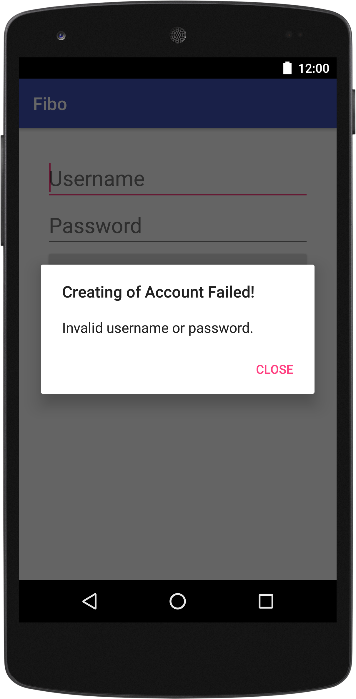

## Kotlin & Anko for Android Development

The main goal of this project is to learn and show how to use Kotlin & Anko for Android development.
 
Because I'm a big fan of the [Requery](https://github.com/requery/requery) library so I'm using it 
for persistent layer.
 
A whole project is now under development so it is not complete. 

Name of application is Fibo - Finance Board - at the end it should be finance managers which you can find 
a lot of in Google Play store, but I want on this usecase show that using a Kotlin, Anko is very powerful 
for android development.

Used libraries/frameworks

* Kotlin 1.1-M04
* [Anko](https://github.com/Kotlin/anko) 0.9
* [Mosby](https://github.com/sockeqwe/mosby) - MVP - 2.0.1
* [Requery](https://github.com/requery/requery) 1.0.0-rc3
* Dagger 2.8
* RxAndroid 1.2.1
* RxKotlin 0.60.0
* [kotpref](https://github.com/chibatching/Kotpref) 1.6.0
* [PaperParcel](https://github.com/grandstaish/paperparcel) 2.0.0-beta2

* Note
 * Documentation is in progress
 * Demo app is under development

### App Description
In this application I would like to show you libraries which I think are very interesting and 
useful for Android development.

#### Login View
First screen of application is the Login view. There you must enter username and password.

<p align="center">
  
</p>

In current version only a demo user can be used:

* username = **frosty**
* password = **snow**

You can find these default values below Sign In button as a hint.

Application allows to remember you - if you will check the **Remember me** checkbox then the next time app display the main dashboard 
directly.

The **Sign In button** is _action process button_ which show progress state of checking authorization credentials. You will see for short 
time a green Sign In button in case of you entered authorization credentials correctly, otherwise you will see red text _Bad Username or Password_ text bewlo button

<p align="center">

  
</p>

The Login process is written in Kotlin and Anko is used to create UI not in XML but 
directly in code by using Anko DSL features.

See [LoginView](https://github.com/vsouhrada/kotlin-anko-demo/blob/master/app/src/main/kotlin/com/vsouhrada/kotlin/android/anko/fibo/function/signin/login/view/LoginView.kt)

What is interesting in this class - that UI is not created in XML but in code:
```kotlin
textView {
  id = R.id.errorView
  lparams {
    gravity = Gravity.CENTER
    topMargin = dip(8)
    bottomMargin = dip(16)
  }
  textColor = ContextCompat.getColor(ctx, R.color.red_error)
  text = string(R.string.error_view_login_text)
  textSize = 14f
  visibility = View.GONE
}
        
textView {
  lparams(width = matchParent, height = wrapContent) {
    gravity = Gravity.CENTER
    leftMargin = dip(16)
    rightMargin = dip(16)
  }
  textColor = ContextCompat.getColor(ctx, R.color.secondary_text)
  text = "Hint:\nusername = frosty   password = snow"
  textSize = 10f
}   
```

The connection between activity and View created in Anko is defined in `onCreate()` method in activity by calling:
`CreateUserView(bus).setContentView(this)`
(See CreateUserActivity)
```kotlin
override fun onCreate(savedInstanceState: Bundle?) {
        super.onCreate(savedInstanceState)
        // DI
        activityComponent().inject(this)
        // Create view
        CreateUserView(bus).setContentView(this)
    }
```

In case of empty username or password -> application must show an alert dialog. By using Anko implementation of dialog is very simple
```kotlin
alert(title = resources.getString(R.string.create_user_alert_failed_title),
      message = resources.getString(R.string.create_user_alert_failed_message)) {
         positiveButton("Close") { this@alert.dismiss() }
}.show()
```
<p align="center">
  
</p>

### Dashboard View
Please keep in a mind that app is under development so do not expect some cool functionality yet.
<p align="center">
  
</p>

#### Show Username
See DrawerActivity
```Kotlin
private fun showUserInfo() {
  val userNameView = find<TextView>(R.id.contentText)

  doAsync {
    val user = userBl.getUser()

    uiThread {
      userNameView.text = user.username
    }
  }
}
```

#### Persistent Layer
As I already mentioned I'm using the Requery library.

##### Insert new user
See UserBL.kt
```kotlin
class UserBL @Inject constructor(val dataStore: KotlinEntityDataStore<Persistable>) : IUserBL { 

 override fun saveUser(userDO: UserDO) {
         val user = UserEntity()
         with(user) {
             userName = userDO.username
             password = userDO.password
         }
 
         doAsync {
             dataStore.insert(user)
         }
     }
}
```

**How to check if user is in db?**
```kotlin
override fun existUser() : Boolean{
  return dataStore.count(User::class).get().value() > 0
}
```

##### Load User from DB
```kotlin
    override fun getUser(): UserDO {
        val result = dataStore.select(UserEntity::class).get().first()

        return concertToDO(result)
    }

    private fun concertToDO(entity: UserEntity): UserDO {
        return UserDO(username = entity.userName, password = entity.password)
    }
```

#### User db table
```kotlin
@Entity
interface User : Persistable {

    @get:Key
    @get:Generated
    var id: Int

    @get:Column(length = 20, unique = true, nullable = false)
    var userName: String

    @get:Column(length = 20, nullable = false)
    var password: String

    @get:Column(length = 20)
    var firstName: String

    @get:Column(length = 20)
    var lastName: String

    @get:Column(length = 30)
    var email: String

    @get:OneToMany
    val userAccounts: List<UserAccount>
}
```
Next features will be added soon